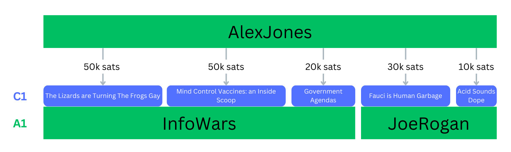
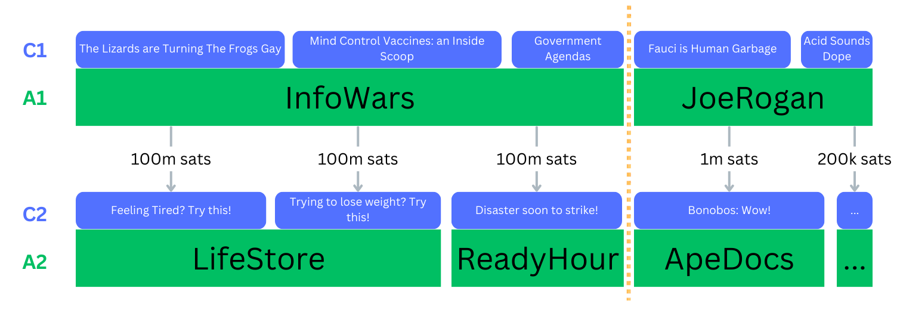

# Zap Trails: A Silver Bullet for Content Curation on Nostr

### In Short:

* Nostr is sitting on a gold mine in the form of zap data - a latent web of trust (or web of value). Using simple algorithms, we can crawl this *zap network* to discover/curate fresh, valuable content and route around spam.
* A client built around this concept would allow content creators to make significant money by providing valuable content, because viral content by definition receives a large volume of zaps.
* A community using such a client would bootstrap an adaptive, self-pruning network that resembles a neural net, where accounts act as neurons and zaps as synapses firing.

(An updated version of writeup is maintained [here](https://github.com/coinop-logan/zap-trails/blob/master/first-writeup.md).)

We'll start with the algorithm.

## A Basic Zap Trail Algorithm

Start with a social media platform with things like notes and zaps, where:
* zaps are cheap/free to execute
* zapping for good content is already in practice by some users
* zapping can reference specific pieces of content
* this zapping history is (at least mostly) public knowledge

I'm new to Nostr, but it seems Nostr checks these boxes.

Assume no prior knowledge of the network, aside from a single account the user trusts which has some nonzero zapping activity - perhaps a friend or well-known public figure. Ask the user to specify this account. Let's call this trusted account AlexJones.

Choose a time window we want to focus on. Let's say a week.

Look at all the zaps sent by AlexJones that reference content in the last week. From this build:
* C1: a list of all the pieces of content referenced by the zaps, weighted by zap size
* A1: a list of the authors of this content, weighted by total amount zapped for their content

The result might look something like this:

Populate the user's feed with content from C1, ordered by weight. Nothing too special yet; at this point we're just reading zaps as boost/reposts with variable weight, using AlexJones as our source of truth (surely that can't go wrong).

But now, we repeat the move, looking at zaps originating from A1 instead of AlexJones, and call these lists A2 and C2. Conserve weight between a given account and its influences on these lists - visualized by the dashed yellow line below:

Again, populate the user's feed with the content zapped, C2. Order the content by its inherited weight - which corresponds to the content box's size in the image above. Because weight is conserved, even though JoeRogan is only zapping about 1% of what InfoWars is, JoeRogan's zaps still determine about 1/3 of A2 and C2.

Repeat the process to find C3/A3, C4/A4, etc. Each iteration follows zaps outward into more of the network, as seen from the perspective of AlexJones. Or more to the point, as *valued* from the perspective of AlexJones (and thus vicariously by our user).

Now encourage the user to send some zaps for content they like, and instead build L1 from the zaps the *user* has sent, rather than AlexJones. Each time the user zaps, L1 becomes more diverse, and this diversity trickles down to L2, L3, and so on.

Actually, we can now reframe that initial step of "endorsing" AlexJones with asking the user to zap any account any amount. This might more commonly be a friend than a celebrity. We can think of this as "seeding" their zap network. Before they zap, they see nothing; after a single zap, they see the network through that zap recipient's eyes; after every subsequent zap, their feed increases in diversity and becomes more their own.

(By the way, this is really just one in a family of zap trail algorithms. See "other algorithms" near the end of this doc.)

## Spam, Zap Networks, and Pruning

Let's start talking in terms of zap *networks*. These are directed graphs, and you could imagine them fruitfully as a set of neurons (accounts) and synapses firing (zaps - pun appreciated!).

Even before introducing pruning tools, spam will have a hard time getting onto a feed built solely from zap networks. If I have only zapped friends and talented artists, and they have only zapped content they in turn value, and so on, we can probably follow zap trails out for quite some time before seeing any spam.

This is related to the fact there is no objective feed to hijack or buy your way into. The algorithm never looks at any central, global list of zaps (or upvotes, or follows) to find globally popular content. Instead the algorithm crawls through the network, using the user's zaps as a starting point in an organically built "web of value".

To get you to see spam, a spammer would have to find an account downstream of your zaps, and somehow get that account to zap their content. The further downstream they aim, the more likely we might imagine their chance of success, but also the further down your feed the spam would appear.

A spammer could of course zap his own content, from any number of accounts. But by itself this does nothing but create an eddy of spammy content within the spammer's own solipsistic network of accounts. No one would even have to go through the trouble of stepping around it - real users' zaps route around it as if it's not even there.

But maybe the spammer has actually accumulated some trust in the network in the way of zaps to him, and wants to now leverage that to get his spam some attention?

Let's introduce, then, the idea of pruning.

Say you see something on your feed about selling some supplements. Ah! Spam! Clutching your attention-pearls closely, you look at the provenance, so to speak, of the content. Looking into it you see the zap trail `you -> AlexJones -> InfoWars -> LifeStore`. Zapping AlexJones has come back to haunt us after all!

So you just blacklist AlexJones, pruning him from your zap network. By now you've built up a much more diverse and organic zap network anyway.

A whole tree of spam, just gone, banished forever, unless AlexJones can get someone else downstream your zap network to zap his content. And if that happens, you can just judiciously prune whatever node in the tree you deem beyond redemption.

Further, these prune actions could be published and respected by zap trail algorithms (Do I smell a NIP?). Then when you remove AlexJones, you're not just doing it for yourself - you're doing it knowing that this will clean up every feed *upstream* of your own - any feed whose user has zapped *you*.

And as a consequence, AlexJones didn't just lose your attention. He lost the attention of everyone who trusted you (or at least, the part of the attention that you were responsible for propagating upstream).

## Zap Network Cultivation and Evolution

What would it look like if a community relied only on this technique? For simplicity let's assume no other mechanisms are used (follows, likes, reposts, etc).

Any given user will be aware, intuitively, of their position as a node in this zap network, this directed graph, this neural net of sorts. Their zaps, sent outward, essentially pull content back to them through these pathways from downstream - and the content doesn't stop there, but travels further upstream, to anyone who has zapped the user. Similarly, pruning prevents this propogation. The user has the experience of cultivating not just their own feed, but the network around them as well.

Think of how this changes what it means to zap. It's no longer only a thank you and a financial reward; it's now a direct boost to the content's virality, propagating it further. A zap in this dynamic would be saying: "this content is good, I want you to have this money, and *people who value me will now see it*".

## The Effect on Content

You sit down and spend a day creating a piece of art. Let's assume it's good. In fact let's assume it's *really good*.

You post it, and it gets one or two initial zaps, perhaps from you or some friends. This gets it some initial visibility on the zap network.

Because it's really good, it starts to get more zaps, and some of them are pretty large. With each zap, your content gains signal upstream. Larger zaps mean stronger signal.

Within this framework, content that spreads == content that people value == content that brings in revenue to its author. Content that travels far brings in a lot of money.

Think of how this changes how it feels to post content. The game isn't exactly engagement anymore. I submit that this will purify content curation in a way analogous to how Bitcoin is posed to purify the economic system, and I hope to demonstrate this soon.

What could you publish in such a paradigm, and make money on, in hours - possibly minutes?

A well-written concise paragraph on a novel thought. A funny joke, a meme. A cool tip for using LLMs. A timely comment on recent events.

Or imagine a long-form format. What could you compose and see the income slowly ramp up for, over days and weeks?

A nuanced view on an over-politicized topic, spreading through people who are equally tired of the tribal shit. A blueprint for a 3d printed widget among 3d printer enthusiasts. A piece of software. A song. A mashup. A series. A scoop.

Content is monetized, without legacy methods such as ads, copyright, DRM, etc.

## What Now?

I believe the above is a cornucopia that, if adopted by a subset of the Nostr community,
* Supercharges content curation and discovery, in a way that aligns with Nostr's values
* Neuters spam
* Puts zaps center-stage, encouraging a massive uptake in zapping as a regular use of content consumption
* Allows content creators to make money with mindblowing effectiveness and rapidity

So what's next?

Firstly, feedback. If I seem to be missing something, I'd like to know! This idea has been bouncing around my head for years. Maybe it's crazy! I don't know!

If the feedback is promising, I intend to approach OpenSats for research funding. If I can get this (or other) support, I'd first prove the concept quickly, perhaps with a minimalist POC, or by modifying some other client, or simply by manually performing the algorithm with well-known accounts and publishing the results.

With the core concept proven - specifically, that by following zaps through the network we get very good content curation and avoid spam - the next step would be to design or modify a client such that it:
* relies primarily or solely on the zap trail algorithms for feed construction
* requires the user set up zapping during onboarding
* puts zapping at center-stage in the UX as the sole or primary action for supporting and "upvoting" content
* supports pruning (likely implemented as an NIP)

With such a client, we'd prime the pump for those exciting second-order dynamics described in the last two sections, of a self-cultivating neural net of content, where content creators could make serious money overnight.

---

### Other Notes

Thank you for coming to my Ted Talk. Here are some other notes and ideas I'm happy to discuss further.

#### Users Must be Zap-Capable

For the above algorithm to work (at least without any other content curation mechanisms), every new user needs to be able to zap. Otherwise, their feed remains empty.

If they can't zap, they could still operate in a sort of read-only mode, looking at the network from the perspective of other accounts (See "What does Alex Jones see?" below). But to participate in the network dynamic, they'd need zaps. Similarly, they could post, but without at least a self-zap (see next section) it wouldn't enter the zap network, and thus would not be seen in anyone's feeds.

We could think of some ways around this, but there's an argument to be made that this is actually a good thing, that we *want* a user to have to set up a lightning wallet and send a first zap.

When Xbox Live first came out, the only way to get on the network was to buy a starter pack which included a mic. This allowed game developers to rely comfortably on the assumption that all Xbox Live players could communicate with voice. Similarly, a Nostr client that takes it for granted that all of its users are capable of zapping can rely comfortably on the dynamics above.

My hunch is that this would be worth the cost of a higher barrier of entry to users.

#### Self-Zaps

With this algorithm strictly imposed, and no other curation algorithm present, posting alone does not actually make content visible. It must also receive a zap - otherwise it doesn't enter the zap network, and thus does not appear on anyone's feed.

This could be addressed with a self-zap, where the amount zapped indicates the author's confidence in the post (relative to their other zaps). Remember that an author can't take up more space/weight in upstream feeds than they've earned through zaps anyway, so there's no reason to disallow self-zaps.

And if we look at it from first principles, is it really so awkward to decouple the act of posting/uploading the content, from the act of promoting/broadcasting? The former is about data upload and would involve some amount of composition in the client interface, and typically involves a single creator. The latter is about social influence, and could include a concerted effort from a whole group.

Of course, an interface could always choose to bundle these in the UX, so that at the step of submitting content the user can zap it at the same step.

#### C1/C2/C3... As Sections

When a user zaps content, it has the effect of essentially pinning it to their feed, because it comes to be in C1. Thus C1 would contain all the content the user has directly liked (within the time window we're working with).

The client could hide this by default, or put it in another section of the interface.

C2 would contain all the content that came from "the next ring out", the content zapped by the accounts whose content the user has liked. C3 would be a further level "out" into the network.

It would makes sense to visually separate these sections, and while we're at it, put the user in charge of requesting the next iteration with a "load more"-like button that actually triggers the next iteration.

#### Other Algorithms

The algorithm described above asks "where does my money go, and through what content?". But it's really just one instance of a family of algorithms; there are some other interesting ways to query the zap network.

To start with, we could reverse the traversal direction, and instead follow zaps "backward", from recipient to sender. Build a list of accounts who have zapped you (C1 would in this case show you what your most popular content is), then find out who zapped them, and so on. Then you are asking "where does my money come from?" This is something like a shift from a focus on where your consumed content comes from, to where your produced content goes - in other words, your *audience*.

Or you could alternate between going forward and backward: who have you zapped? Call it A1. Who *else* has zapped A1? Call it A0 - these are "people who like what you liked". Now where do zaps from A0 go? You start to ask the question "What do people like me value?" Further iteration would broaden the definition of "people like me".

Users could choose from a drop-down menu of such algorithms. Perhaps they could even modify or create their own.

Or we could even empower users to explore real-time, following sets of accounts around, so that we no longer talk of "iterating" over a fixed algorithm, but rather moves we can perform to move from one set of users/content to another. Paired with a search string, this could be an extremely powerful research tool.

#### What does Alex Jones see?

We could also look at the network from a starting node other than the user. Doing this would be like "putting on the glasses" of the target user. What do they see? Try on different algorithms while you're at it. Where do they get their zaps from?

What are the conservatives valuing? What about the Germans? What about a group of 3 people whose opinions you respect but are quite divergent?